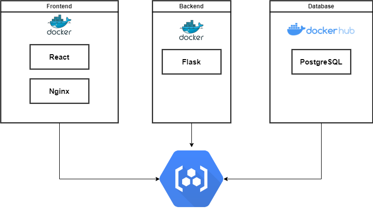

# Software-Containerization
App for WS2022 Course Software Containerization at VU

## Contents:
- /backend - Flask implementation for the back end of application
- /frontend - React implementation for the front end of application
- /helm-charts - Helm files to deploy application on cluster
- /kubernetes - Services, deployments, secrets, ingress etc.

## Setup:
Create a cluster on GCP and connect to it
```
gcloud container clusters get-credentials $CLUSTER_NAME --zone $YOUR_ZONE --project $YOUR_PROJECT_NAME
```

Install the nginx ingress controller on GCP

Execute the following commands to install the nginx ingress controller
```
helm repo add ingress-nginx https://kubernetes.github.io/ingress-nginx
helm repo update
helm install nginx-ingress ingress-nginx/ingress-nginx
kubectl get deploy
```

Wait a few moments while the load balancer gets deployed and then retrieve the EXTERNAL-IP associated with the nginx-ingress service
```
kubectl get service nginx-ingress-ingress-nginx-controller -ojson | jq -r '.status.loadBalancer.ingress[].ip'
```
The output should look like this 35.239.106.62. This IP address will later be used to set the correct hostname in the values.yaml of the helm chart. 

Build and push docker images to Container Registry
```
docker build . -t gcr.io/$YOUR_PROJECT_NAME/backend:v1
docker push gcr.io/$YOUR_PROJECT_NAME/backend:v1

docker build . -t gcr.io/$YOUR_PROJECT_NAME/frontend:v1
docker push gcr.io/$YOUR_PROJECT_NAME/frontend:v1
```
Create TLS Certificate
We already created the secrets, but with the following command new keys can be created.
```
openssl req -x509 -sha256 -nodes -newkey rsa:4090 -keyout key.pem -out cert.pem
```

Set up Artifact Registry on GCP


Package the helm chart and push it to Artifact Registry
```
helm package helm
helm push software-containerization-0.1.0.tgz oci://us-central1-docker.pkg.dev/$YOUR_PROJECT_NAME/$YOUR_ARTIFACT_REPO_NAME
```

Install helm chart on GKE

```
helm install $HELM_CHART oci://us-central1-docker.pkg.dev/$YOUR_PROJECT_NAME/$YOUR_ARTIFACT_REPO_NAME/$HELM_CHART --version 0.1.0
```


## Presentation




Check permissions for roles created by RBAC

```
kubectl auth can-i get configmaps --as <gcloud-user-email>
```

Show how to scale the application horizontally

Change the replicaCount to 5 in values.yaml and version to 0.1.1 in charts.yaml
```
helm upgrade software-containerization software-containerization-0.1.1.tgz
```


Show how you re-build the application after a source code change (1 point):

```
docker build . -t gcr.io/diesel-dominion-375713/frontend:v2
docker push gcr.io/diesel-dominion-375713/frontend:v2
kubectl set image deployment/software-containerization-frontend-deployment software-containerization-frontend-container=gcr.io/diesel-dominion-375713/frontend:v2
```

Show how you upgrade the running application in two ways:

deployment rollout (2 points):

canary update (2 points):


Show how to uninstall the application (1 point):

```
    helm uninstall software-containerization
    kubectl get all -n default
```

